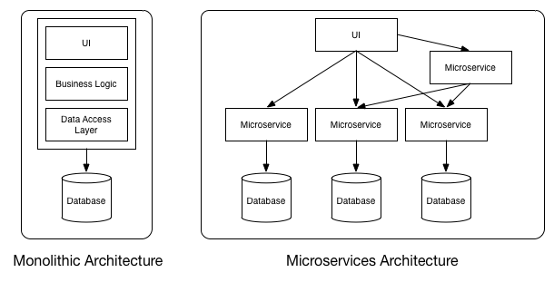
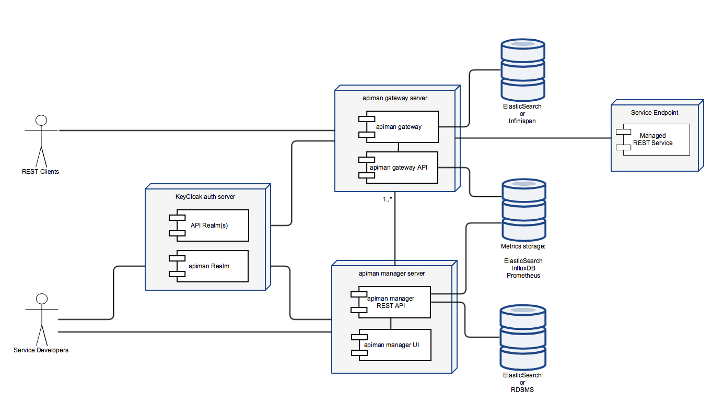
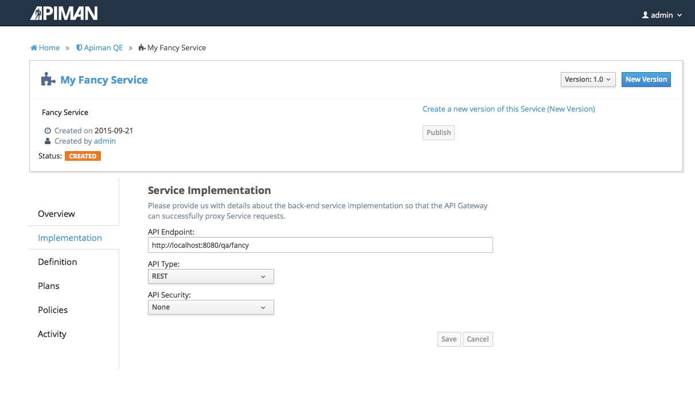
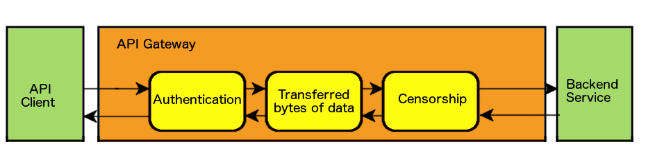
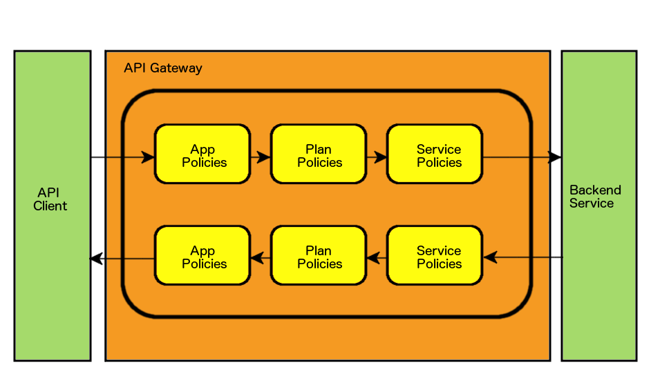

:backend: revealjs
:revealjs_theme: solarized
:reaveljs_control: false
:revealjs_slideNumber: true
:revealjs_history: true
:revealjs_center: true
:source-highlighter: pygments

== API Management with JBoss Apiman
Jakub Čecháček <jcechace@redhat.com>

image::resources/lecture/logo_rh.png[logo, frame="none"]

////////////////////////////////////////////////////////////////////////////////
    Introduction
////////////////////////////////////////////////////////////////////////////////
== Lecture Overview
- Why do we need API Management?
- What is JBoss apiman?
- Architecture
- Data Model
- Policies available OOTB

////////////////////////////////////////////////////////////////////////////////
    Introduction to API Management
////////////////////////////////////////////////////////////////////////////////
== APIs, APIs Everywhere
- Service Oriented Architecture (SOA) is often used
- It's easier to compose new applications from existing APIs
- Single business logic
- Multiple clients
- SOAP, REST, or any other RESTful API

== Microservices on the way
- Each service is deployed separately
- Implementing only narrow functionality
- SOA done right!
- Large number of (micro) services
- Cross cutting concerns

=== Micro Vs. Mono

== Why API Management?
- Authentication and Authorization
- Usage statistics
- Limiting access to your API
- Version management
- Billing
- Additional layer of request/response control

////////////////////////////////////////////////////////////////////////////////
    Jboss apiman Introduction
////////////////////////////////////////////////////////////////////////////////
== JBoss apiman
- Open source API management tool
- Young and rapidly growing project
- Current version is 1.1.8.Final

== Advantages
- Rich management Layer
- Easily embeddable and extensible
- Fully asynchronous
- Built with Scalability in mind
- Configuration in single property file

////////////////////////////////////////////////////////////////////////////////
    Architecture
////////////////////////////////////////////////////////////////////////////////
== Architecture

// Manager
//
== API Manager
- Sort and structure your APIs
- Set of REST endpoints
- Configuration time

// Management UI
=== Management UI
- Provides an easy way to configure your API management
- Lightweight angular.js application
- Under the hood utilizes manager's REST API

=== Management UI

// Gateway
//
== API Gateway
- A proxy between client and APIs
- Multiple platforms (servlet, vert.x)
- Applies policies to API requests
- Execution time

== Policies
- Rules applied on request / response at runtime
- Manipulate request / response headers
- Manipulate the payload data

== Manager Vs. Gateway
- Gateway REST API
- Configuration is published (pushed) to gateway
- Once published service can't be modified

////////////////////////////////////////////////////////////////////////////////
    Data Model
////////////////////////////////////////////////////////////////////////////////
== Entity Hierarchy

// Organizations
//
== Organizations
- Top level structure unit
- Representation of a company, department, team,...
- Consumed and Provided APIs

// Roles
=== Roles & Permissions
- Service, Plan, Application
- View / Edit / Admin
- Auto-granted roles

=== Out of the Box Roles
- Organization owner
- Application developer
- Service provider

// Services
//
== Services
- Representation service provider
- Backed by REST or SOAP endpoint
- Version management

=== Accessing to Services
- Public service accessible to anyone
- Service available through plan to registered consumers

// Plans
//
== Plans
- Set of defined policies
- Way to share policy configuration between services
- Way to distinguish between categories of your consumers

// Applications
//
== Applications
- Counterpart to Services
- Representation of service consumer
- Application can consume multiple services

=== Contracts
- Application, Service, Plan
- Form of subscription
- Application is assigned a unique API key

// Policies
//
== Policy Chain

// Versions
//
== Versioning
- Is supported on each level: Application, Service, Plan
- Version needs to be pushed to the Gateway
- register / publish / lock

////////////////////////////////////////////////////////////////////////////////
    Available Policies
////////////////////////////////////////////////////////////////////////////////
== Out of the Box Policies

=== Rate Limiting
- Throttle the number of requests to your API
- User, Application, Service
- Per unit of time (second, minute, hour, etc...)

=== Transfer Quotas
- Throttle the amount of data transfered through your API
- Download, Upload, Combined
- User, Application, Service
- Per unit of time (second, minute, hour, etc...)

=== Ignored Resource
- Disable parts of your API
- Support for regular expressions

=== Basic Authorization
- Adds HTPP BASIC authentication to API request
- Multiple identity stores (static, JDBC, LDAP)

=== IP Address Filtering
- Two policies (Whitelist and Blacklist)
- List of IP addresses with allowed / denied access
- Support for wildcards

////////////////////////////////////////////////////////////////////////////////
    Plugins
////////////////////////////////////////////////////////////////////////////////
== Plugins
- Java Web Archive (WAR) with JSON descriptor
- Distributed through maven
- Search local repository first
- Plugin registry

=== Plugin registry
- Simple JSON Descriptor
- Maven repository
- List of plugin artifacts

=== registry.json
[source,json]
{
  "name" : "Official apiman Plugins",
  "description" : "This plugin registry lists all of the official apiman plugins.  No third party plugins are included in this registry.",
  "version" : "1.2.0-SNAPSHOT",
  "repository" : {
    "name" : "JBoss Public Maven Repository",
    "url" : "http://repository.jboss.org/nexus/content/groups/public/"
  },
  "plugins" : [
    {
      "groupId" : "io.apiman.plugins",
      "artifactId" : "apiman-plugins-cors-policy",
      "version" : "1.2.0-SNAPSHOT",
      "name" : "CORS Policy Plugin",
      "description" : "This plugin implements CORS (Cross-origin resource sharing): A method of controlling access to resources outside of an originating domain."
    },
    {
      "groupId" : "io.apiman.plugins",
      "artifactId" : "apiman-plugins-http-security-policy",
      "version" : "1.2.0-SNAPSHOT",
      "name" : "HTTP Security Policy Plugin",
      "description" : "Provides a policy which allows security-related HTTP headers to be set, which can help mitigate a range of common security vulnerabilities."
    }
  ]
}

////////////////////////////////////////////////////////////////////////////////
    Future
////////////////////////////////////////////////////////////////////////////////
== What's to come?
- Billing support
- Developer portals
- Support for WebSocket
- Support for Messaging

== Get Involved
- Homepage: http://www.apiman.io
- Sources: https://github.com/apiman/apiman
- Mailing list: apiman-user@lists.jboss.org
- IRC channel: +++#+++apiman on Freenode

////////////////////////////////////////////////////////////////////////////////
    Questions
////////////////////////////////////////////////////////////////////////////////
== Questions?
== Thank You!

