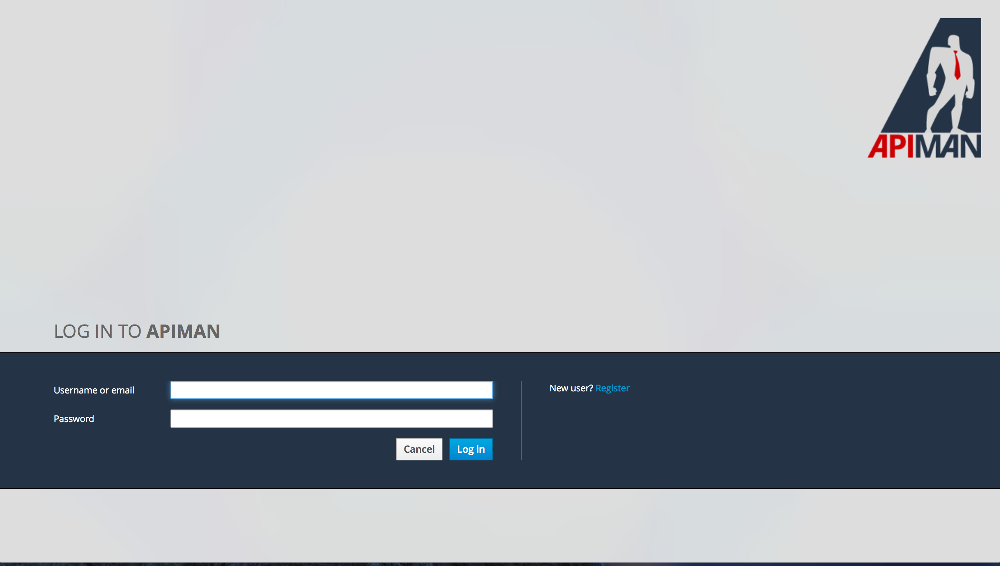
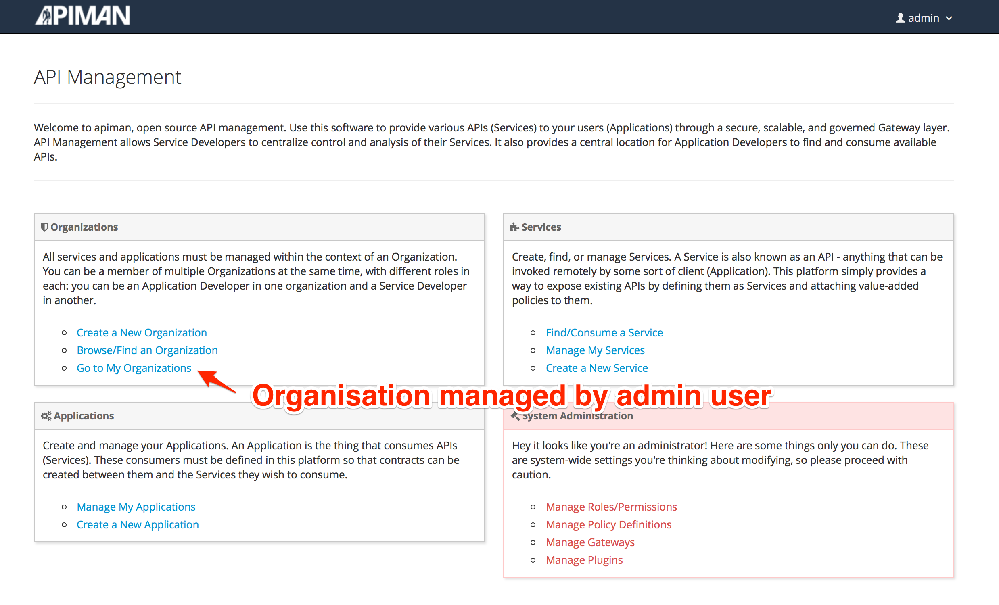
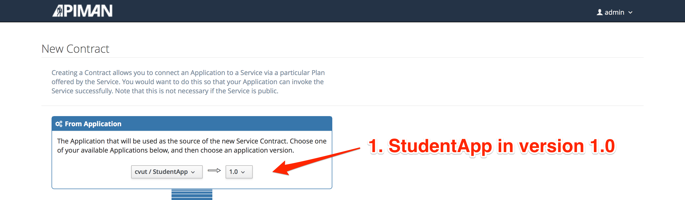

:backend: revealjs
:revealjs_theme: solarized
:reaveljs_control: false
:revealjs_slideNumber: true
:revealjs_history: true
:revealjs_center: true
:source-highlighter: pygments

== JBoss Apiman: Hands on Lab
Jakub Čecháček <jcechace@redhat.com>

////////////////////////////////////////////////////////////////////////////////
    Installation
////////////////////////////////////////////////////////////////////////////////
== 1. Download and Run JBoss apiman

=== Download
- http://download.jboss.org/wildfly/8.2.0.Final/wildfly-8.2.0.Final.zip[Wildfly 8.2.0.Final]
- http://downloads.jboss.org/apiman/1.2.0.Alpha2/apiman-distro-wildfly8-1.2.0.Alpha2-overlay.zip[Apiman Overlay 1.2.0.Alpha2]

=== Install
[source, bash]
$ unzip wildfly-8.2.0.Final.zip
$ unzip apiman-distro-wildfly8-1.2.0.Alpha2-overlay.zip -d wildfly-8.2.0.Final

=== Run
[source, bash]
$ cd wildfly-8.2.0.Final
$ ./bin/standalone.sh -c standalone-apiman.xml

[source, bash]
11:02:54,989 INFO  [org.jboss.as.server] (ServerService Thread Pool -- 29) JBAS018559: Deployed "services.war" (runtime-name : "services.war")
11:02:54,989 INFO  [org.jboss.as.server] (ServerService Thread Pool -- 51) JBAS018559: Deployed "main-auth-server.war" (runtime-name : "main-auth-server.war")
11:02:54,989 INFO  [org.jboss.as.server] (ServerService Thread Pool -- 29) JBAS018559: Deployed "authtest-ds.xml" (runtime-name : "authtest-ds.xml")
11:02:54,990 INFO  [org.jboss.as.server] (ServerService Thread Pool -- 29) JBAS018559: Deployed "apimanui.war" (runtime-name : "apimanui.war")
11:02:54,990 INFO  [org.jboss.as.server] (ServerService Thread Pool -- 29) JBAS018559: Deployed "apiman.war" (runtime-name : "apiman.war")
11:02:54,990 INFO  [org.jboss.as.server] (ServerService Thread Pool -- 29) JBAS018559: Deployed "apiman-gateway.war" (runtime-name : "apiman-gateway.war")
11:02:54,990 INFO  [org.jboss.as.server] (ServerService Thread Pool -- 29) JBAS018559: Deployed "apiman-gateway-api.war" (runtime-name : "apiman-gateway-api.war")
11:02:54,990 INFO  [org.jboss.as.server] (ServerService Thread Pool -- 29) JBAS018559: Deployed "apiman-es.war" (runtime-name : "apiman-es.war")
11:02:54,990 INFO  [org.jboss.as.server] (ServerService Thread Pool -- 29) JBAS018559: Deployed "apiman-ds.xml" (runtime-name : "apiman-ds.xml")
11:02:54,997 INFO  [org.jboss.as] (Controller Boot Thread) JBAS015961: Http management interface listening on http://127.0.0.1:9990/management
11:02:54,998 INFO  [org.jboss.as] (Controller Boot Thread) JBAS015951: Admin console listening on http://127.0.0.1:9990
11:02:54,998 INFO  [org.jboss.as] (Controller Boot Thread) JBAS015874: WildFly 8.2.0.Final "Tweek" started in 10477ms - Started 935 of 1060 services (203 services are lazy, passive or on-demand)
11:02:55,000 INFO  [org.elasticsearch.gateway] (elasticsearch[Gronk][clusterService#updateTask][T#1]) [Gronk] recovered [1] indices into cluster_state

////////////////////////////////////////////////////////////////////////////////
    Deploy quickstart
////////////////////////////////////////////////////////////////////////////////
== 2. Deploy The Echo Quickstart

=== Clone the repository
[source, bash]
$ git clone https://github.com/apiman/apiman-quickstarts.git

=== Build
[source, bash]
$ cd apiman-quickstarts
$ mvn clean install -DskipTests

=== Deploy
[source, bash]
$ cd "echo-service"
$ mvn wildfly:deploy

_For the purpose of this lab we are deploying to the same server as the one used by apiman. In production environment you would use a separate deployment server._

=== Try the service
[source, bash]
$ curl http://localhost:8080/apiman-echo
{
  "method" : "GET",
  "resource" : "/apiman-echo",
  "uri" : "/apiman-echo",
  "headers" : {
    "Accept" : "*/*",
    "User-Agent" : "curl/7.43.0",
    "Host" : "localhost:8080"
  },
  "bodyLength" : null,
  "bodySha1" : null
}

The response from _apiman-echo_ endpoint is a JSON formatted information about the request.

////////////////////////////////////////////////////////////////////////////////
    Management REST API
////////////////////////////////////////////////////////////////////////////////
== 3. Management REST API

=== Accessing the REST API
- Available at http://localhost:8080/apiman
- Documentation available http://www.apiman.io/latest/api-manager-restdocs.html[here]
- Username: "admin"
- Password: "admin123!"

=== Postman REST client
- https://www.getpostman.com[Postman HTTP client for Google Chrome]
- https://www.getpostman.com/collections/063fdd9e365859cfab12[Request collection for Postman]

=== Import request collection
image::resources/lab/postman_import.png[Postman collection import]

=== Using the REST API
image::resources/lab/postman_requests.png[Postman requests]

////////////////////////////////////////////////////////////////////////////////
    Management UI
////////////////////////////////////////////////////////////////////////////////
== 4. Meet the Management UI

=== Accessing the Management UI
- Point your browser to http://localhost:8080/apimanui
- Username: "admin"
- Password: "admin123!"

=== Manage organizations
- Inspect the previously created *"cvut"* organization

////////////////////////////////////////////////////////////////////////////////
    Plans in UI
////////////////////////////////////////////////////////////////////////////////
== 5. Manage plans in UI

=== Create a Plan
- Create a new plan under the *"cvut"* organization
- Name it *"student-plan"*

image::resources/lab/ui_org_plans.png[Organization plans, width="80%", height="80%"]

=== Add Rate Limit
- Add a Rate Limiting policy
- Allowing 20 requests per application to service per minute

image::resources/lab/ui_policy_config.png[Add Rate Limiting Policy,  width="60%", height="60%"]

=== Lock the plan
- Once locked, plan can be used by services

image::resources/lab/ui_plan_lock.png[Locking the plan]

=== Create Second Plan
- Add another plan to the *"cvut"* organization
- Name it *"professor-plan"*
- Services under this plan will accept only 10 requests per minute from each app
- Don't forget to lock the plan

////////////////////////////////////////////////////////////////////////////////
    Services in UI
////////////////////////////////////////////////////////////////////////////////
== 6. Manage Services in UI

=== Manage Services
image::resources/lab/ui_org_services.png[Organization services, width="80%", height="80%"]

=== Create New Service Version (Echo 2.0)
- Create a new version of echo service.
- Clone the configuration from version 1.0

image::resources/lab/ui_service_new_version.png[New service version]

=== Service and Plans
- Echo 2.0 will be available through created plans
- This version will not be publicly accessible

image::resources/lab/ui_service_plans.png[Service plan configuration, width="70%", height="70%"]

=== Publish service version
image::resources/lab/ui_service_publish.png[Publish service version]

////////////////////////////////////////////////////////////////////////////////
    Applications in UI
////////////////////////////////////////////////////////////////////////////////
== 7. Manage Applications in UI

=== Create an Application
- Create new application
- Name it *"StudentApp"*

image::resources/lab/ui_org_apps.png[Create application]

=== Add Service Contract
image::resources/lab/ui_app_contracts.png[Application contracts]

=== Add Service Contract: Application

=== Add Service Contract: Service
image::resources/lab/ui_app_contract_service.png[Create contract: Service]

=== Add Service Contract: Plan
image::resources/lab/ui_app_contract_plan.png[Create contract: Plan]

=== Register the Application
- Once registered, the application will be assigned an API key for each service contract

=== Obtain managed endpoint
- Try to invoke the echo service as *"StudentApp"*

image::resources/lab/ui_app_apis.png[Consumed APIs, width="70%", height="70%"]

=== Create Second Application
- Create new application
- Name it *"ProfessorApp"*
- This app will use the echo service through the *"professor-plan"*

////////////////////////////////////////////////////////////////////////////////
    The end
////////////////////////////////////////////////////////////////////////////////
== Do not stop here!

